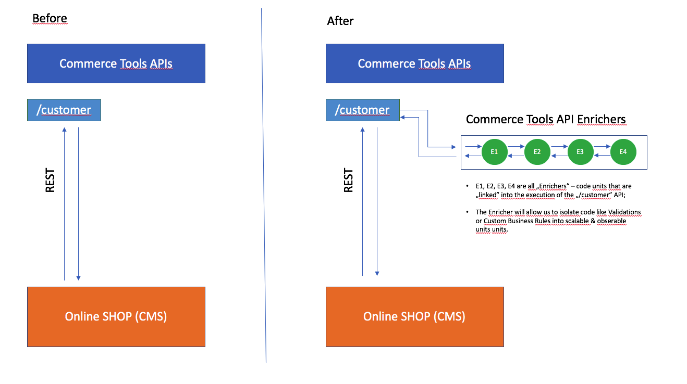

# Deloitte Commerce Tools API Enricher

## Summary

**Commerce Tools** (CT) is a headless commerce solution that offers a broad range of REST APIs to interact with. By default the **CT** are not opiniated, meaning that they accept most data in an unformatted way (eg.: **CT** allows developers to create a customer with an invalid email address or with a `null` first name.)

The **Commerce Tools API Enricher** (CTAE) it's a **Deloitte** Asset that enables developers to "decorate" the existing **CT** APIs with additional (custom) business logic that is encapsulated into small independent "code units" called *Enrichers*.

By using **CTAE** developers will be able to focus directly on the business logic, without dealing with the underlying integration layer.

From a technical perspective **CTAE** was designed as lightweight Spring Boot framework & microservice, that is also "containerized" and can scale automatically in a horizontal manner.

**CTAE** makes heave use of a new feature from *Commerce Tools* called [API Extensions](https://docs.commercetools.com/http-api-projects-api-extensions).

<div style="page-break-after: always;"></div>

## Architecture

The following images are describing how **Commerce Tools** and **Commerce Tools API Enricher** are working togheter side by side.




In the picture you can see how all `Enrichers` (E1, E2, E3, E4, etc.) are basically linked together in a chain of execution.

They will be called after **CT** process the initial REST Request, but before **CT** persists the results into the database.

What this means is that an `Enricher` can invalidate a request that for example contains "erroneous" data. Or in another case, an `Enricher` can trigger the sending of an email.

<div style="page-break-after: always;"></div>

## How to use

The Enricher is a simple Java class that need to `extend` the corresponding `Enrichment` abstract class.

For example if we want to create an Enricher for the `/customer` interface that will validate if the supplied `email` value is valid, we will write:

```java
@Component
public class CustomerEmailEnricher extends CustomerEnricher {
    EmailValidator emailValidator = EmailValidator.getInstance();

    @Override
    public void enrich(BlockingSphereClient client, JsonNode data) {
        String email = data.get("email").asText();

        if (!emailValidator.isValid(email)) {
            throw new IllegalArgumentException("Invalid email");
        }
    }

}
```

The framework will do the rest of the job for us.

No need for additional configuration, the class will be automatically discovered and linked with the `/customer` API from Commerce Tools.
